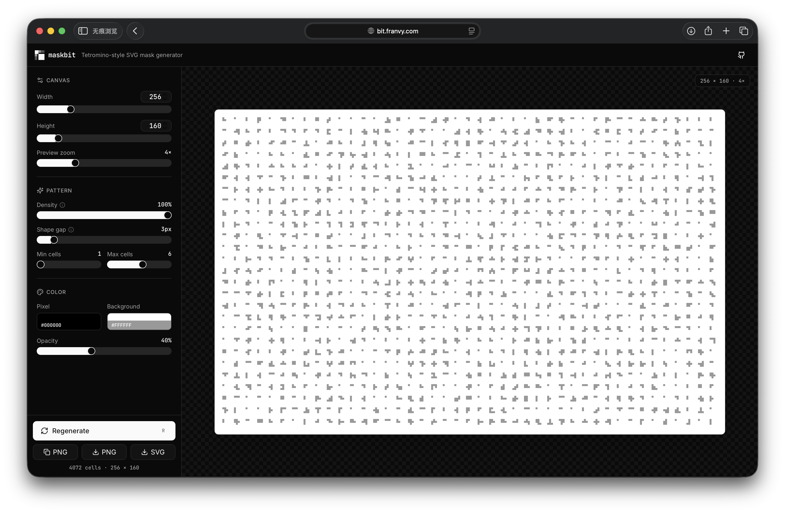

# maskbit

A tetromino-style SVG/PNG mask generator. Procedurally place small connected pixel clusters across a canvas to produce noise patterns, dither textures, and design masks — then export as crisp SVG or pixel-perfect PNG.

**Live demo:** [bit.franvy.com](https://bit.franvy.com)



## Features

- **Tetromino-shaped noise** — every dot is a connected cluster of 1px cells (configurable 1–10 cells each)
- **Full control** — width, height, density, gap, cell range, color, opacity, background
- **Live preview** — pixelated zoom up to 12× with checkered transparency background
- **One-click export** — Copy PNG to clipboard, download PNG, or download SVG
- **Keyboard shortcuts** — `R` to regenerate, `⌘/Ctrl + S` to download SVG
- **Accessible** — full keyboard navigation, focus rings, ARIA labels, tooltips on technical params
- **Dark UI** — built on shadcn/ui + Radix primitives + Tailwind CSS

## Tech stack

- **Vite 6** + **React 18** + **TypeScript**
- **Tailwind CSS 4** + **shadcn/ui** components
- **Radix UI** primitives (Slider, Tooltip, etc.)
- **Lucide** icons
- **Sonner** for toasts

## Getting started

```bash
# Install
npm install

# Dev server
npm run dev          # → http://localhost:5173

# Production build
npm run build
```

## How it works

Given a canvas of `W × H` pixels:

1. The generator scans the canvas with a step driven by `gap + 1` pixels.
2. At each scan position, density % decides whether to drop a shape there.
3. Each shape is a randomly-grown connected cluster of `[minCells, maxCells]` 1px cells (a generalized tetromino).
4. Cells are emitted as `<rect>` elements inside an SVG, then optionally rasterized to PNG via canvas with `imageRendering: pixelated` for crisp output.

See [`src/app/components/noise-generator.ts`](src/app/components/noise-generator.ts) for the algorithm.

## Parameters

| Param | Range | Description |
|---|---|---|
| **Width / Height** | 20 – 1024 px | Real canvas size (the exported file's dimensions) |
| **Preview zoom** | 1× – 12× | On-screen zoom only; does not affect output |
| **Density** | 1 – 40 % | Probability of placing a shape at each scan position |
| **Shape gap** | 1 – 20 px | Empty pixels between adjacent shapes |
| **Min cells / Max cells** | 1 – 10 | Range of cell count per generated shape |
| **Pixel color** | hex | Foreground color of each cell |
| **Background** | hex | Frame background (transparent in exported SVG) |
| **Opacity** | 0 – 100 % | Per-cell alpha |

## Project structure

```
src/
├── app/
│   ├── App.tsx                    # Main UI
│   └── components/
│       ├── noise-generator.ts     # Procedural algorithm
│       └── ui/                    # shadcn/ui primitives
├── styles/                        # Tailwind, theme tokens, fonts
└── main.tsx                       # React entry
```

## Deployment

This project is statically built (`npm run build`) and can be deployed to any static host (Vercel, Netlify, Cloudflare Pages, GitHub Pages).

## License

MIT
